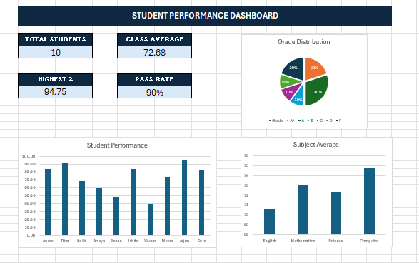

# Student Performance Analysis Dashboard

## 📌 Project Overview

This project analyzes student academic performance using Microsoft Excel. The project transforms raw student marks into meaningful insights using formulas, KPIs, charts, and a dashboard.

## 🎯 Project Objective

The objective of this project is to analyze student marks and create a clear dashboard that helps understand overall student performance, grade distribution, subject averages, and pass rate.

## 🛠️ Tools Used

- Microsoft Excel
- Excel Formulas
- Conditional Formatting
- Excel Charts
- Dashboard Design

## 📊 Dataset

The dataset contains marks for 10 students across four subjects:

- English
- Mathematics
- Science
- Computer

## 🧮 Excel Functions Used

- `SUM` – Calculate total marks
- `AVERAGE` – Calculate averages
- `COUNTIF` – Count students by grade
- `IF` – Determine grades and pass/fail status

## 📈 Dashboard Features

The dashboard includes:

- Total Students
- Class Average
- Highest Percentage
- Pass Rate
- Grade Distribution
- Student Performance
- Subject Average

## 🔍 Key Findings

The dashboard shows that most students achieved passing grades. Computer has the highest subject average, while the grade distribution provides a clear overview of overall student performance.

## 📷 Dashboard Preview



## 📁 Project Structure

```text
Student-Performance-Analysis/
│
├── Student_Performance_Analysis.xlsx
├── README.md
│
└── Screenshots/
    └── dashboard.png

🚀 Conclusion

This project demonstrates how Microsoft Excel can be used to transform raw student marks into meaningful performance insights.

By using formulas, conditional formatting, KPIs, and charts, the project presents academic data in a clear and visually understandable dashboard.
